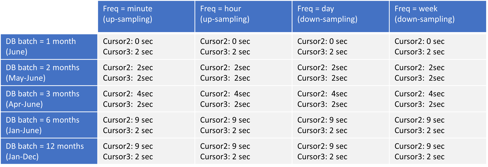
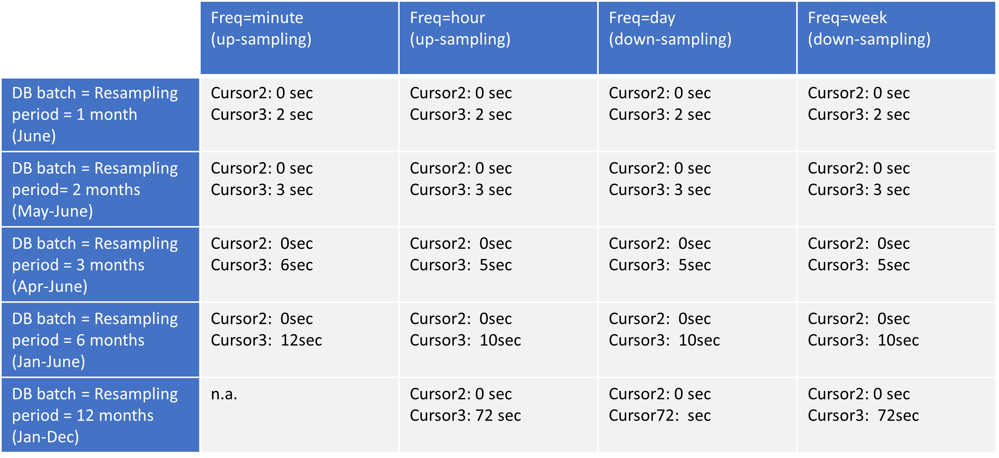

# Datenbanken Big Data: MongoDB Performance
## Workflow Instructions
Steps:

1. console: pip3 install -r requirements.txt

2. console: docker-compose up

3. wait until containers are up and running

4. go to data directory and clone: git clone https://tankerkoenig@dev.azure.com/tankerkoenig/tankerkoenig-data/_git/tankerkoenig-data
    There are two data structures:
* prices: data structure describing gas price changes over time
* stations: data structure describing gas stations
5. choose the operation you want to perform in **src/config.py**
    There are three operations available (to select, set control(operation) = True): 
* ingestion: ingest data (stations/prices) to MongoDB container
* query: query data (stations/prices) from MongoDB container
* resampling: perform resampling of data structure 'prices' in MongoDB container

    For each operation specify the parameters of the data you want to call as described in the script (time stamps (year, month, day, hour, minute, second), station ID, etc.)

6. python3 run **src/db_handling.py**

When performing the operation, console output and a json log file will be generated

The underlying objective is to measure performance of operations in MongoDB (operation duration)

## Results Ingestion Performance

### Test condition
All ingestions starts with a empty db.

### Performance

Ingestion mongoDB collection: prices

* Mothly (year: 2015, month: 06):      446.21 sec.   / 0:07:26.210
* Annual (year: 2015):                 13465.98 sec. / 3:44:25.980
* Complete until 19.10.2022:           61832.96 sec. / 17:10:32.960

Recording with batch size: 20 files ~ 140 MB, 
MB = 1000 x 1000 (Calculation like in mongoDB)

| DB size (MB)     | Raw size (MB) | Elapsed batch time sec. | sum of files |
| ---------------- | ------------- | ----------------------- | ------------ |
| 139.52           | 864.79        | 135.22                  | 20           |
| 928.45           | 7658.58       | 164.84                  | 200          |
| 1902.26          | 15693.7       | 195.14                  | 400          |
| 3145.29          | 25436.9       | 231.85                  | 600          |
| 4461.55          | 35288.92      | 243.96                  | 800          |
| 5891.53          | 45922.52      | 289.12                  | 1000         |
| 7570.01          | 58173.26      | 359.1                   | 1200         |
| 9343.22          | 71066.05      | 297.81                  | 1400         |
| 11067.61         | 83590.61      | 390.74                  | 1600         |
| 12890.51         | 96552.16      | 483.55                  | 1800         |
| 15059.21         | 111497.49     | 551.19                  | 2000         |
| 17384.58         | 127268.43     | 509.92                  | 2200         |
| 19852.76         | 143800.58     | 642.81                  | 2400         |
| 22417.78         | 160895.29     | 643.29                  | 2600         |
| 25151.98         | 178802.78     | 683.79                  | 2800         |
| 27983.65         | 196770.76     | 621.34                  | 3000         |

## Results Query Performance

### Test condition

The requests refer to a fully filled database (until 19.10.2022)

### Performance

Query: Find all gas stations that have a price change in dieselchange or e5change or e10change
Period: 28.09.2022 0:0:0 until 30.09.2022 23.59.59
City: Meschede 59872

The above query took mongo db 15.46 seconds to complete.

## Results Resampling Performance

The time series collection 'prices' can be resampled. Gas price changes are not bound to a fixed time interval.
An equally distributed time interval needs to be generated by MongoDB in order to perform resampling operations.
Usually, prices changes occur a few times per day as can be concluded from the recorded measurements.
Thus, an hourly interval (or shorter) can be considered as use case for up sampling, 
whereas a daily interval (or larger) can be considered as use case for down sampling.
The gas price calculation contains three steps using PyMongo aggregation() pipelines:

1. Determination of lower bound prices, marking the start price at the beginning of the resampling interval (note: price values prior to the resampling interval have to be present)
2. The actual resampling, consisting in:
   * generation of empty documents in the properly timed staggering (densify()) and storing data in Cursor2
   * fill in the last known value of the original time series available (fill()) and storing data in Cursor3
3. Determination of average time weighted mean of the gas prices for the resampling period

As of now, there is no PyMongo aggregation function available to perform step 3. 
Thus, the third step has been carried out using plain Python and Pandas library and is therefore excluded from MongoDB performance measures.
Nevertheless, the result can be obtained in the console output. E.g. for period from 2015-01-04 00:00:00 to 2015-12-30 23:59:59 while prices available at the beginning of the interval find consideration:

| parameter            | value [Euro] |
|----------------------|--------------|
| weighted mean diesel | 1.22         |
| weighted mean e5     | 1.43         |
| weighted mean e10    | 1.41         |

Regarding step 1 the amount of data prior to the resampling interval in the collection was found to be crucial for performance of price lower bound determination (Cursor2).
The data of the collection 'prices' ingested to MongoDB before performing the resampling runs is given by parameter **DB batch**.
Step 1 matches records that occurred before the resampling interval and picks the last value for each price from the grouped items. 
But this might be not efficient as the time series in MongoDB, is partitioned by source and sorted by time for each source. 
The matching by time stage in the beginning violates that indexing order. 
On the other hand, due to the lack of fixed time intervals in the original measurements, the minimum time span between last record before the resampling interval and the beginning of the resampling interval varies and cannot be pre-set.
The obtained operational times from the performance measurement runs (Cursor2) for a resampling interval between **4.6.2015 0:00:00 and 30.06.2015 23:59:59** for station ID **3907c523-3831-4eaf-aec3-d88cc68f5b2e** are summarized in the following table:

Note, that the time to determine the lower bound prices does neither depend on resampling frequency nor on the amount of records posterior the resampling interval.
A quasi linear degradation of performance with the amount of records prior tp the resampling interval can be concluded.

Regarding step 2 the temporal performance of MongoDBs resampling (Cursor3) depends on the duration of the selected resampling interval and thus on the amount of records being captured.
Again, the performance is found to be robust against variation of resampling frequency. Therefore, the number of newly generated documents seems to be unproblematic.
Nevertheless, an expansion of the resampling interval leads to an increasing deterioration of the performance of MongoDBs resampling aggregation function.
One conclusion from the behavior might be, that the performance deterioration stems from the function fill() rather than densify(). Further investigations could further examine if this effect.
The obtained operational times from the performance measurement investigations (Cursor3) for station ID **3907c523-3831-4eaf-aec3-d88cc68f5b2e** are given below:

Note that the resampling interval starts at day four of the respective month (see issue step 1).
Further note that PyMongo densify() only supports generation of up to 500k documents. Thus, a minute-wise resampling of the one-year interval exceeds this limit and cannot be computed.